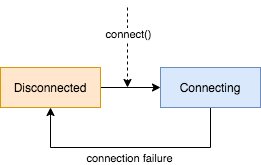
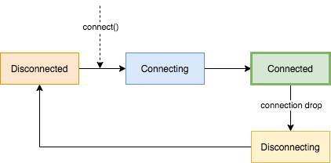

# Keep-alive

Provides keep-alive (reconnects if connection drops) GATT communication.

## Structured Concurrency

A keep-alive GATT is created by calling the `keepAliveGatt` extension function on
[`CoroutineScope`], which has the following signature:

```kotlin
fun CoroutineScope.keepAliveGatt(
    androidContext: Context,
    bluetoothDevice: BluetoothDevice,
    disconnectTimeoutMillis: Long,
    onConnectAction: ConnectAction? = null
): KeepAliveGatt
```

| Parameter                 | Description                                                                                                               |
|---------------------------|---------------------------------------------------------------------------------------------------------------------------|
| `androidContext`          | The Android `Context` for establishing Bluetooth Low-Energy connections.                                                  |
| `bluetoothDevice`         | `BluetoothDevice` to maintain a connection with.                                                                          |
| `disconnectTimeoutMillis` | Duration (in milliseconds) to wait for connection to gracefully spin down (after `disconnect`) before forcefully closing. |
| `onEventAction  `         | Actions to perform upon either connection or disconnection. `onConnect` is performed after connection, and `onDisconnect` |
|                           | is performed after a disconnection, either post connection-state or after a failure to connect.                           |

For example, to create a `KeepAliveGatt` as a child of Android's `viewModelScope`:

```kotlin
class ExampleViewModel(application: Application) : AndroidViewModel(application) {

    private const val MAC_ADDRESS = ...

    private val gatt = viewModelScope.keepAliveGatt(
        application,
        bluetoothAdapter.getRemoteDevice(MAC_ADDRESS),
        disconnectTimeoutMillis = 5_000L // 5 seconds
    ) {
        // Actions to perform on initial connect *and* subsequent reconnects:
        discoverServicesOrThrow()
    }

    fun connect() {
        gatt.connect()
    }
}
```

When the parent [`CoroutineScope`] (`viewModelScope` in the above example) cancels, the
`KeepAliveGatt` also cancels (and disconnects).

When cancelled, a `KeepAliveGatt` will end in a `Cancelled` state. Once a `KeepAliveGatt` is
`Cancelled` it **cannot** be reconnected (calls to `connect` will throw `IllegalStateException`); a
new `KeepAliveGatt` must be created.

## Connection Handling

A `KeepAliveGatt` will start in a `Disconnected` state. When `connect` is called, `KeepAliveGatt`
will attempt to establish a connection (`Connecting`). If the connection is rejected (e.g. BLE is
turned off), then `KeepAliveGatt` will settle at `Disconnected` state. The `connect` function can be
called again to re-attempt to establish a connection:


If a connection cannot be established (e.g. BLE device out-of-range) then `KeepAliveGatt` will retry
indefinitely:



Once `Connected`, if the connection drops, then `KeepAliveGatt` will automatically reconnect:



_To disconnect an established connection or cancel an in-flight connection attempt, `disconnect` can
be called (it will suspend until underlying [`BluetoothGatt`] has disconnected)._

### Connection State

The state can be monitored via the `state` [`Flow`] property:

```kotlin
val gatt = scope.keepAliveGatt(...)
gatt.state.collect { println("State: $it") }
```

## I/O

If a Gatt operation (e.g. `discoverServices`, `writeCharacteristic`, `readCharacteristic`, etc) is
unable to be performed due to a GATT connection being unavailable (i.e. current `State` is **not**
`Connected`), then it will immediately throw `NotReady`.

It is the responsibility of the caller to handle retrying, for example:

```kotlin
class GattCancelled : Exception()

suspend fun KeepAliveGatt.readCharacteristicWithRetry(
    characteristic: BluetoothGattCharacteristic,
    retryCount: Int = Int.MAX_VALUE
): OnCharacteristicRead {
    repeat(retryCount) {
        suspendUntilConnected()
        try {
            return readCharacteristicOrThrow(characteristic)
        } catch (exception: Exception) {
            // todo: retry strategy (e.g. exponentially increasing delay)
        }
    }
    error("Failed to read characteristic $characteristic")
}

private suspend fun KeepAliveGatt.suspendUntilConnected() {
    state
        .onEach { if (it is Cancelled) throw GattCancelled() }
        .first { it == Connected }
}
```

### Characteristic Changes

When a `KeepAliveGatt` is created, it immediately provides a [`Flow`] for incoming characteristic
changes (`onCharacteristicChange` property). The [`Flow`] is a hot stream, so characteristic change
events emitted before subscribers have subscribed are dropped. To prevent characteristic change
events from being lost, be sure to setup subscribers **before** calling `KeepAliveGatt.connect`, for
example:

```kotlin
val gatt = scope.keepAliveGatt(...)

fun connect() {
    // `CoroutineStart.UNDISPATCHED` executes within `launch` up to the `collect` (then suspends),
    // before allowing continued execution of `gatt.connect()` (below).
    launch(start = CoroutineStart.UNDISPATCHED) {
        gatt.onCharacteristicChange.collect {
            println("Characteristic changed: $it")
        }
    }

    gatt.connect()
}
```

If the underlying [`BluetoothGatt`] connection is dropped, the characteristic change event stream
remains open (and all subscriptions will continue to `collect`). When a new [`BluetoothGatt`]
connection is established, all it's characteristic change events are automatically routed to the
existing subscribers of the `KeepAliveGatt`.

## Error Handling

When connection failures occur, the corresponding `Exception`s are propagated to `KeepAliveGatt`'s
parent [`CoroutineScope`] and can be inspected via [`CoroutineExceptionHandler`]:

```kotlin
val exceptionHandler = CoroutineExceptionHandler { _, throwable ->
    println(throwable)
}
val scope = CoroutineScope(Job() + exceptionHandler)
val gatt = scope.keepAliveGatt(...)
```

# Setup

## Gradle

[](https://maven-badges.herokuapp.com/maven-central/com.juul.able/keep-alive)

```groovy
repositories {
    jcenter() // or mavenCentral()
}

dependencies {
    implementation "com.juul.able:keep-alive:$version"
}
```


[`BluetoothDevice.connectGatt`]: https://developer.android.com/reference/android/bluetooth/BluetoothDevice#connectGatt(android.content.Context,%20boolean,%20android.bluetooth.BluetoothGattCallback)
[`BluetoothGatt`]: https://developer.android.com/reference/android/bluetooth/BluetoothGatt
[`CoroutineScope`]: https://kotlin.github.io/kotlinx.coroutines/kotlinx-coroutines-core/kotlinx.coroutines/-coroutine-scope/
[`CoroutineContext`]: https://kotlinlang.org/api/latest/jvm/stdlib/kotlin.coroutines/-coroutine-context/
[`Flow`]: https://kotlin.github.io/kotlinx.coroutines/kotlinx-coroutines-core/kotlinx.coroutines.flow/-flow/
[`CoroutineExceptionHandler`]: https://kotlin.github.io/kotlinx.coroutines/kotlinx-coroutines-core/kotlinx.coroutines/-coroutine-exception-handler/
